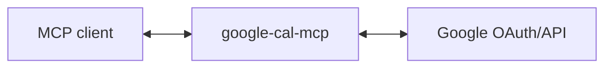

# google-cal-mcp

MCP server for Google Calendar - list, create, update, and manage calendar events.

## Use Cases

**Schedule meetings**: "Set up a 30-min sync with Sarah next week" → finds a free slot, creates the event with a Meet link, and sends the invite.

**RSVP to invites**: "Accept the team offsite but decline the vendor demo" → responds to pending invitations automatically.

**Find availability**: "When am I free this Thursday afternoon?" → queries your calendar and returns open slots.

**Reschedule events**: "Move my 1:1 with Alex to Friday at 2pm" → updates the event and notifies attendees.

**Daily briefing**: "What's on my calendar today?" → lists all events with times, locations, and attendees.

**Block focus time**: "Block 2 hours tomorrow morning for deep work" → creates a calendar event to protect your time.

(These are just examples - any workflow that needs calendar access can use this.)

## Setup

### 1. Create Google OAuth credentials

1. Go to [Google Cloud Console](https://console.cloud.google.com/)
2. Create a new project (or use existing)
3. Enable the Google Calendar API
4. Go to **APIs & Services** → **OAuth consent screen**, set up consent screen
5. Go to **APIs & Services** → **Credentials** → **Create Credentials** → **OAuth client ID**
6. Choose **Web application**
7. Add `http://localhost:3000/callback` to **Authorized redirect URIs**
8. Note your Client ID and Client Secret

### 2. Run the server

```bash
GOOGLE_CLIENT_ID='your-client-id' \
GOOGLE_CLIENT_SECRET='your-client-secret' \
MCP_TRANSPORT=http \
npm start
```

The server runs on `http://localhost:3000` by default. Change with `PORT=3001`.

### 3. Add to your MCP client

```bash
claude mcp add --transport http google-cal-mcp http://localhost:3000/mcp
```

## Architecture

This server acts as an **OAuth proxy** to Google:



1. Server advertises itself as an OAuth authorization server via `/.well-known/oauth-authorization-server`
2. `/register` returns the Google OAuth client credentials
3. `/authorize` redirects to Google, encoding the client's callback URL in state
4. `/callback` receives the code from Google and forwards to the client's callback
5. `/token` proxies token requests to Google, injecting client credentials
6. `/mcp` handles MCP requests, using the bearer token to call Calendar API

The server holds no tokens or state - it just proxies OAuth to Google.

## Tools

| Tool | Description |
|------|-------------|
| **Calendars** | |
| `calendars_list` | List all calendars the user has access to |
| `calendarlist_insert` | Subscribe to a shared calendar |
| `calendarlist_update` | Update calendar settings (color, visibility, reminders) |
| `calendarlist_delete` | Unsubscribe from a calendar |
| **Events** | |
| `events_list` | List events in a time range with search/filter |
| `event_get` | Get details of a specific event |
| `event_create` | Create a new event with attendees and Meet link |
| `event_update` | Update an existing event |
| `event_delete` | Delete an event |
| `event_respond` | RSVP to an invitation (accept/decline/tentative) |
| `event_move` | Move event to a different calendar |
| `event_instances` | Get instances of a recurring event |
| **Availability** | |
| `freebusy_query` | Find free/busy times for scheduling |
| **Sharing** | |
| `acl_list` | List who has access to a calendar |
| **Colors** | |
| `colors_get` | Get available color palette for calendars/events |

## Calendar API Scopes

- `calendar` - Full access to calendars
- `calendar.events` - Read/write events

## Contributing

Pull requests are welcomed on GitHub! To get started:

1. Install Git and Node.js
2. Clone the repository
3. Install dependencies with `npm install`
4. Run `npm run test` to run tests
5. Build with `npm run build`

## Releases

Versions follow the [semantic versioning spec](https://semver.org/).

To release:

1. Use `npm version <major | minor | patch>` to bump the version
2. Run `git push --follow-tags` to push with tags
3. Wait for GitHub Actions to publish to the NPM registry.
